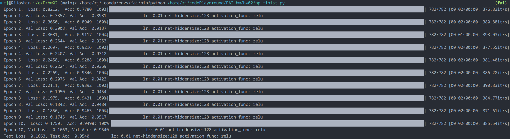
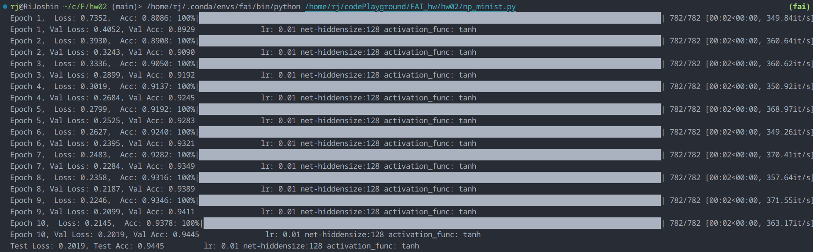
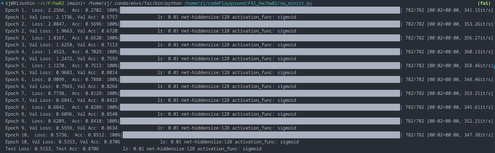
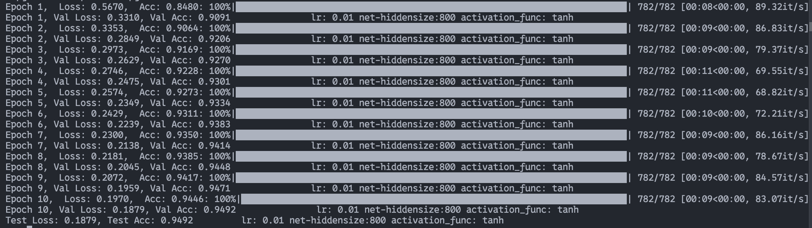
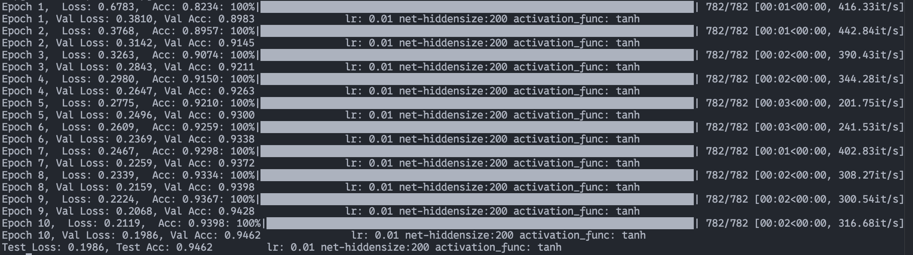
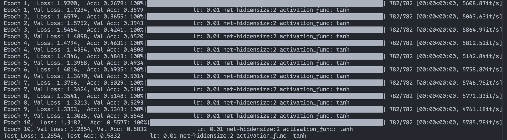
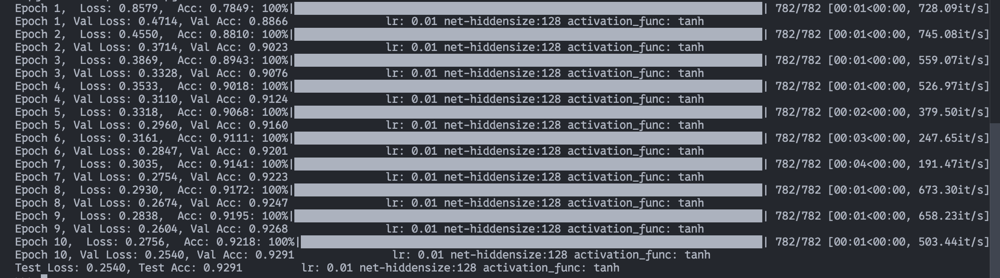
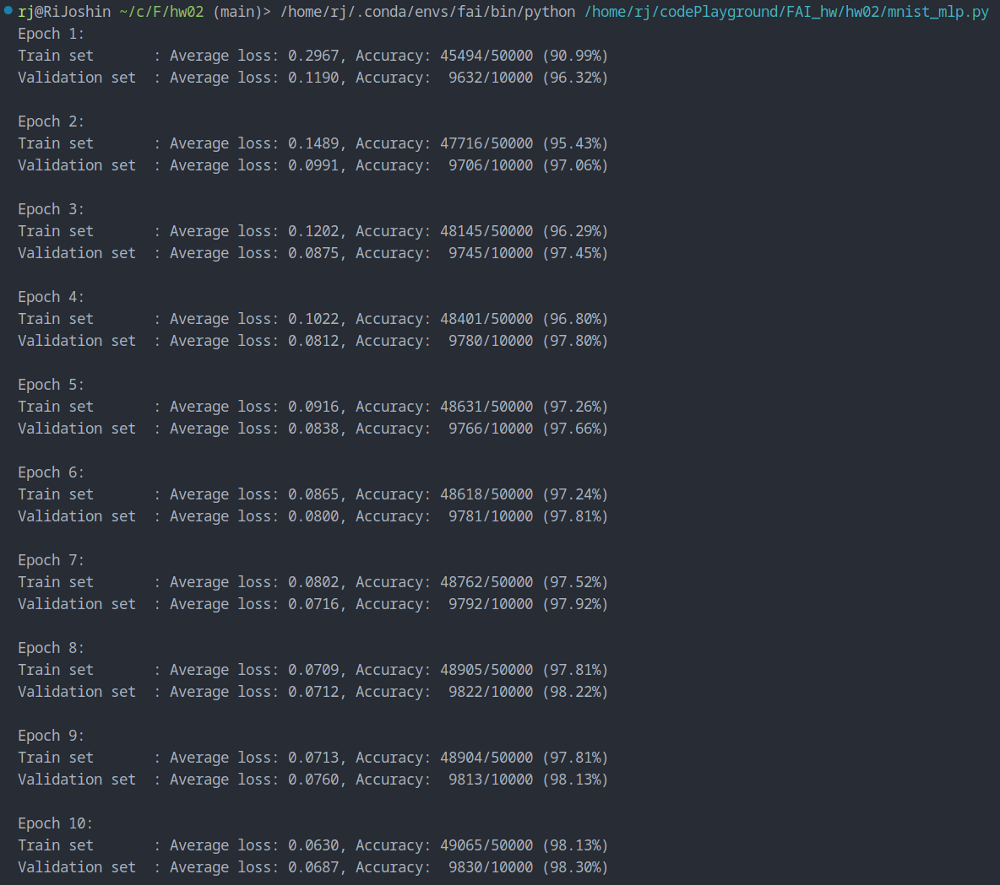
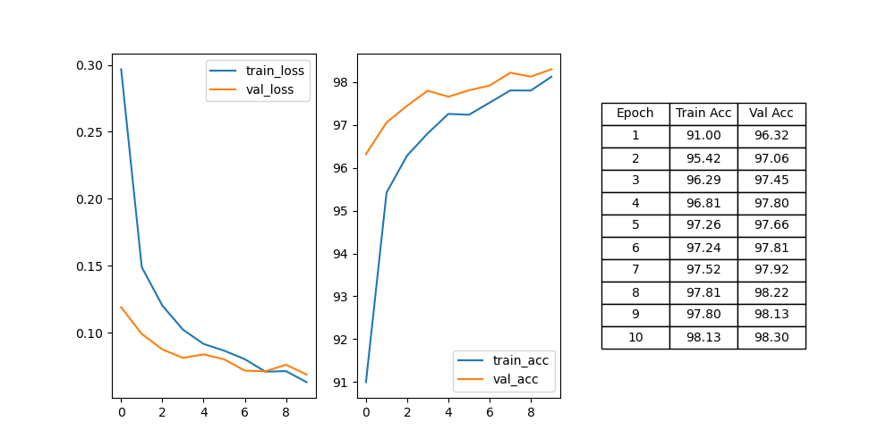

 HW 02

> 李靖昕
> 2400013201

## 01
> 用numpy实现训练MLP网络识别手写数字MNIST数据集

### 改激活函数

Net: 784 -> 128 -> 128 -> 10

Loss: CrossEntropy

1. ReLU (Epoch 10, Test acc: 95.40%,  Loss: 0.1663)

   

2. Tanh (Epoch 10, Test acc: 94.45%, Loss: 0.2019)

   

3. Sigmoid (Epoch 10, Test acc: 87.06%, Loss: 0.5153)

   

### 调整网络架构

- 784  $\to$  800  $\to$  800   $\to$  10 (训练很慢，参数太多)
- 784  $\to$  200  $\to$  200   $\to$  10 （速度差为10X，相对上一个）
- 784  $\to$  20   $\to$  10 （意料之中很低，中间特征太少，保存不了太多信息）
- 784  $\to$  128   $\to$  10 

## 02

> 使用Pytorch训练MNIST数据集的MLP模型任务介绍

### Adam + Dropout(0.5)

(Epoch: 10, Loss: 0.0687, Acc: 98.30%)

| 部分网络结构试验                                | Train_Acc(%) | Val_Acc(%) |
| ----------------------------------------------- | ------------ | ---------- |
| 784-Dropout(.5)-800-Dropout(.5)-800-10 + Adam   | 98.12        | 98.30      |
| 784-Dropout(.5)-1000-Dropout(.5)-800-10 + Adam  | 99.40        | 98.16      |
| 784-Dropout(.1)-1000-Dropout(.5)-800-10 + Adam  | 99.49        | 97.72      |
| 784-Dropout(.9)-1000-Dropout(.5)-800-10 + Adam  | 99.48        | 97.80      |
| 784-1000-800-10 + Adam                          | 99.35        | 97.79      |
| 784-800-800-10 + Adam                           | 99.44        | 98.06      |
| 784-800-800-10 + SGD                            | 82.05        | 84.66      |
| 784-Dropout(.5)-900-Dropout(.5)-800-10-RMSprop- | 97.52        | 97.44      |
| 784-900-800-10-RMSprop                          | 99.51        | 97.54      |

